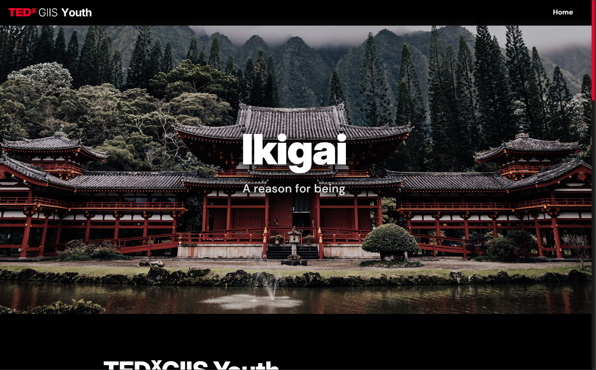

# TEDxGIIS Youth
This is a website made for the TEDxGIIS Youth event centered around the theme of Ikigai (A reason for living). This website is aimed to provide information to participants about the event and how they can attend it.

The website is currently hosted on [TEDxGIIS Youth](https://tedxgiis.vercel.app/) Vercel where it can be viewed

## Stack

The website has been made using the following frameworks

- NodeJS
- Express
- Supabase
- EJS

## Setup

Install node, express, and supabase.
`npm install node express @supabase/supabase-js`

Create an ENV file with the following information

```
SUPABASE_URL=
SUPABASEKEY=
```
Run the index.js fiel using node index.js